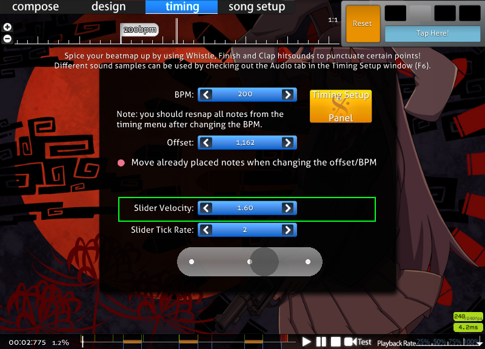

import Callout from "@/components/Callout.astro";

---

Also posted on the osu! forums: [https://osu.ppy.sh/community/forums/topics/1851087](https://osu.ppy.sh/community/forums/topics/1851087)

Here is a description of how scroll speed works in osu!taiko. I couldn't find this information anywhere else so I did my own research. Hopefully people will find this useful. If more information comes to me I'll do my best to keep this up to date.

In case it matters: this research was done as of November 2023 on the "classic" osu! client. 

## Calculation

<Callout>
The following section will list values in "pixels", which assumes a 800x600 resolution. 
In the end all the pixel units cancel out, but e.g. for 1280x720 you want to multiply all "pixel" values by 720/600.
</Callout>

Here's a reference image:


The typical scroll speed is 245 pixels/beat. This is calculated as 175 * 1.4 from the beatmap's slider velocity setting. Most maps have their slider velocity at the default 1.4, but a small number of songs have set it differently, e.g. [Yoru Naku Usagi wa Yume o Miru](https://osu.ppy.sh/beatmapsets/58951#taiko/388464) which has a base slider velocity of 1.6 => 175 * 1.6 = 280 pixels/beat.



HR applies a 1.4 multiplier and scales by aspect ratio to give 343 * (aspect ratio) / (4/3) pixels/beat. For 4:3 this is 343 pixels/beat (1.4x), and 16:9 this is 457 pixels/beat (1.87x).

EZ applies a 0.8 multiplier. This is not affected by aspect ratio. The base scroll speed is 245 * 0.8 = 196 pixels/beat.

Finally BPM and inherited timing points affect scroll speed. To convert pixels/beat to pixels/second multiply by 1 beat/second = bpm/60. Inherited timing points then apply a fixed multiplier on top of that.

The distance between the left side of the screen and the receptor, at least on the default skin, is 165 pixels. That makes the total playfield length 600 * r - 165 pixels where r is your aspect ratio. (for 4:3, the playfield is 635 pixels long. For 16:9, the playfield is 901 pixels long.)

Here's some example code representing the calculations.


```python
def playfield_width(aspect_ratio):
    return 600 * aspect_ratio - 165

def scroll_rate(aspect_ratio, is_hr):
    return 245 * ((1.4 * aspect_ratio / (4/3)) if is_hr else 1)

def reaction_time(aspect_ratio, is_hr, bpm, base_sv=1.4, inherited_sv=1):
    return playfield_width(aspect_ratio) / (scroll_rate(aspect_ratio, is_hr) * bpm/60 * base_sv/1.4 * inherited_sv)
```


## Analysis

What's interesting is that higher aspect ratios on HR give slightly more reaction time. This is because while scroll speed scales in HR, the HUD is a fixed size, so the proportion of screen dedicated to the playfield increases, an extra factor which isn't accounted for in HR scaling.


- bpm advantage factor vs. 4:3: (160 * r - 44)/(127 * r) where r is aspect ratio [1]
- at 16:9 it's 1.065x (about 10-15bpm)
- at 21:9 it's 1.11x (about 20-25bpm)
- at 45:9 it's 1.19x
- asymptote is at 160/127 = 1.25x


However I've tried it and changing resolution won't make you instantly skill boost, mostly because of having to relearn HR at a different resolution.

You can visually verify this by taking screenshots at different aspect ratios. More notes are visible at higher aspect ratios.

[1] - [wolfram link](https://www.wolframalpha.com/input?i=solve+%28600r-165%29%2F%28%28245*14%2F10*r%2F%284%2F3%29%29%2F60+*+y%29+%3D+%28600*%284%2F3%29-165%29%2F%28%28245*14%2F10*%284%2F3%29%2F%284%2F3%29%29%2F60+*+x%29+for+y). Basically calculating the bpms at which the reaction times on 4:3 and aspect ratio r are equal.

## Comparison with AR in osu!std

The formula for AR in seconds is (1200 - 750 * (ar-5)/5)/1000. Below are some tables comparing certain values of BPM and AR.


- 200bpm HR = AR9.29 (4:3), AR9.05 (16:9)
- 220bpm HR = AR9.63 (4:3), AR9.41 (16:9)
- 240bpm HR = AR9.91 (4:3), AR9.71 (16:9)
- at 4:3: AR9 = 259bpm or 185bpm HR, AR10 = 345bpm or 247bpm HR
- at 16:9: AR9 = 368bpm or 197bpm HR, AR10 = 491bpm or 262bpm HR


Here is a desmos where you can play with the calculations: [link](https://www.desmos.com/calculator/yo2jx1w2z2).

AR9 and AR10 are pretty fast.


|     | 4:3    |       |        |       | 16:9     |      |        |       |
|-----|--------|-------|--------|-------|----------|------|--------|-------|
|     | Nomod  |       | HR     |       | Nomod    |      | HR     |       |
| BPM | ms     | AR    | ms     | AR    | ms       | AR   | ms     | AR    |
| 180 | 863.95 | 7.24  | 617.10 | 8.89  | 1,408.16 | 3.61 | 657.19 | 8.62  |
| 200 | 777.55 | 7.82  | 555.39 | 9.30  | 1,267.35 | 4.55 | 591.47 | 9.06  |
| 220 | 706.86 | 8.29  | 504.90 | 9.63  | 1,152.13 | 5.32 | 537.70 | 9.42  |
| 240 | 647.96 | 8.68  | 462.83 | 9.91  | 1,056.12 | 5.96 | 492.89 | 9.71  |
| 260 | 598.12 | 9.01  | 427.23 | 10.15 | 974.88   | 6.50 | 454.98 | 9.97  |
| 280 | 555.39 | 9.30  | 396.71 | 10.36 | 905.25   | 6.97 | 422.48 | 10.18 |
| 300 | 518.37 | 9.54  | 370.26 | 10.53 | 844.90   | 7.37 | 394.31 | 10.37 |
| 320 | 485.97 | 9.76  | 347.12 | 10.69 | 792.09   | 7.72 | 369.67 | 10.54 |
| 340 | 457.38 | 9.95  | 326.70 | 10.82 | 745.50   | 8.03 | 347.92 | 10.68 |
| 360 | 431.97 | 10.12 | 308.55 | 10.94 | 704.08   | 8.31 | 328.60 | 10.81 |
| 380 | 409.24 | 10.27 | 292.31 | 11.05 | 667.02   | 8.55 | 311.30 | 10.92 |
| 400 | 388.78 | 10.41 | 277.70 | 11.15 | 633.67   | 8.78 | 295.74 | 11.03 |


|      |     | 4:3      |          | 16:9     |          |
|------|-----|----------|----------|----------|----------|
| AR   | ms  | BPM (NM) | BPM (HR) | BPM (NM) | BPM (HR) |
| 8    | 750 | 207.35   | 148.10   | 294.42   | 157.73   |
| 8.2  | 720 | 215.99   | 154.28   | 306.69   | 164.30   |
| 8.4  | 690 | 225.38   | 160.98   | 320.02   | 171.44   |
| 8.6  | 660 | 235.62   | 168.30   | 334.57   | 179.23   |
| 8.8  | 630 | 246.84   | 176.32   | 350.50   | 187.77   |
| 9    | 600 | 259.18   | 185.13   | 368.03   | 197.16   |
| 9.2  | 570 | 272.82   | 194.87   | 387.40   | 207.53   |
| 9.4  | 540 | 287.98   | 205.70   | 408.92   | 219.06   |
| 9.6  | 510 | 304.92   | 217.80   | 432.97   | 231.95   |
| 9.8  | 480 | 323.98   | 231.41   | 460.03   | 246.45   |
| 10   | 450 | 345.58   | 246.84   | 490.70   | 262.88   |
| 10.2 | 420 | 370.26   | 264.47   | 525.75   | 281.65   |
| 10.4 | 390 | 398.74   | 284.82   | 566.20   | 303.32   |
| 10.6 | 360 | 431.97   | 308.55   | 613.38   | 328.60   |
| 10.8 | 330 | 471.24   | 336.60   | 669.14   | 358.47   |
| 11   | 300 | 518.37   | 370.26   | 736.05   | 394.31   |